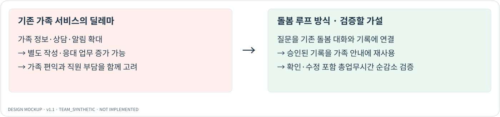
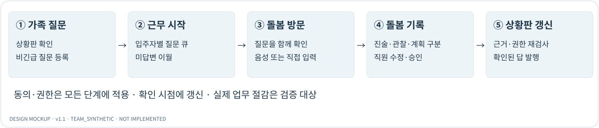
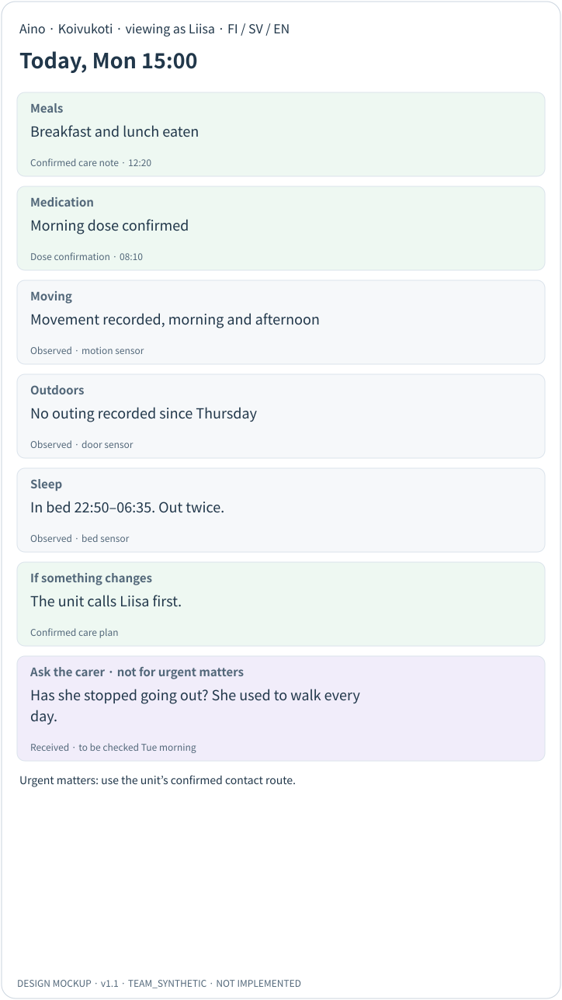
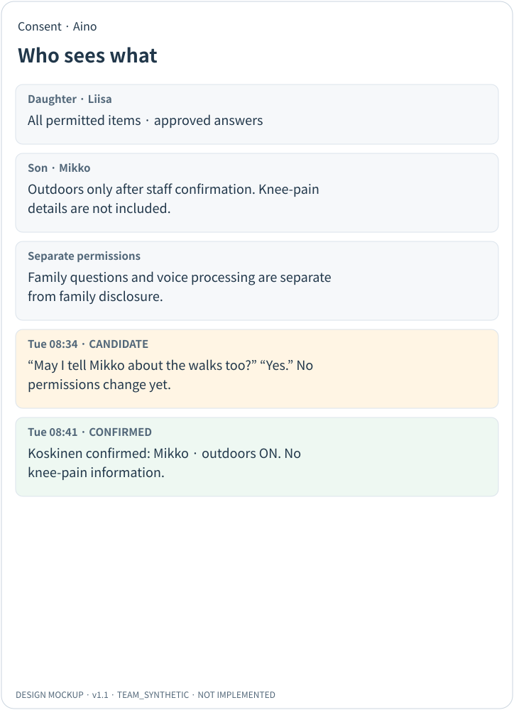
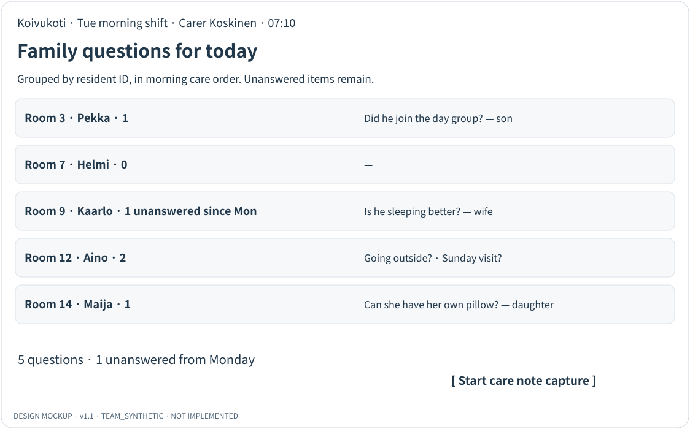
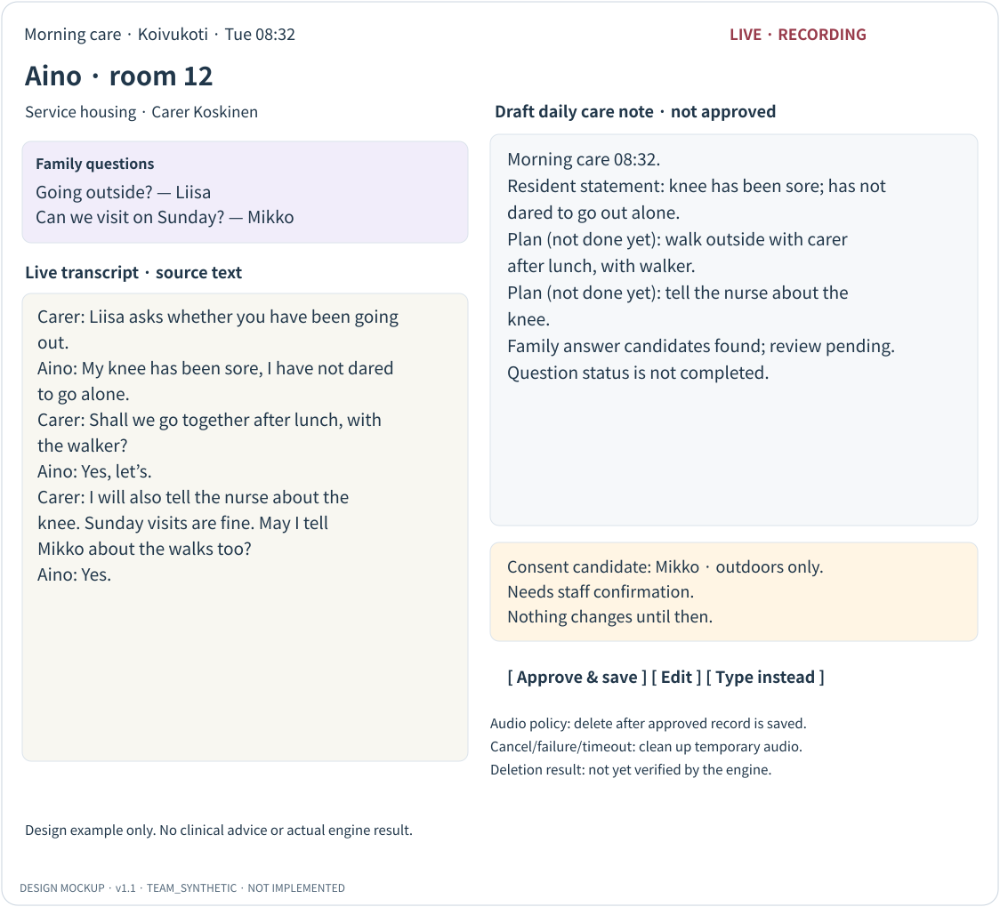
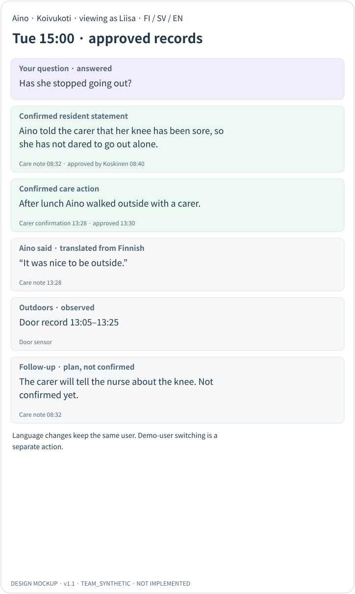
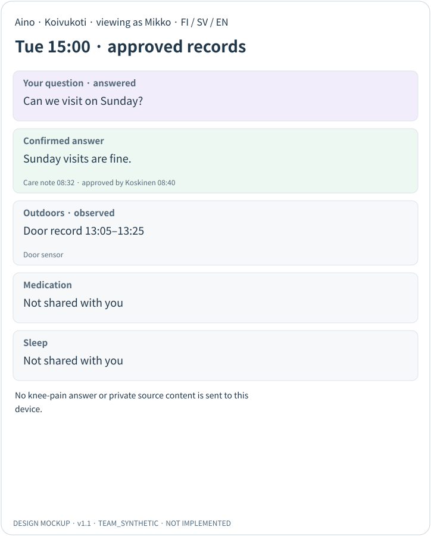
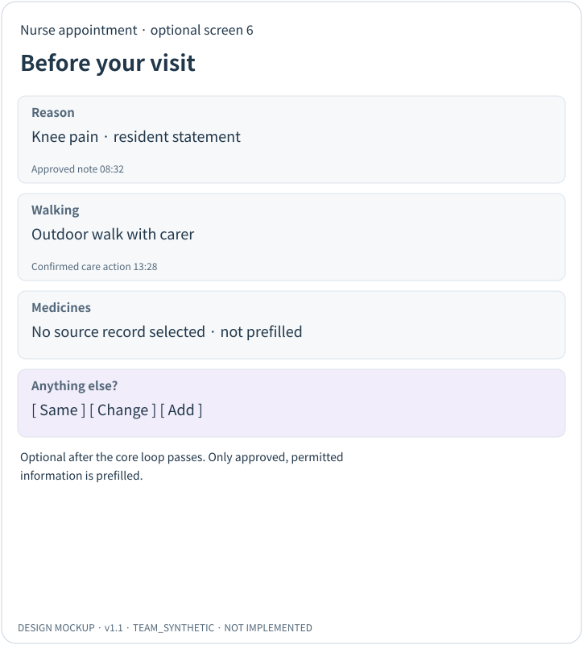

# MediPencil · Päivän kuulumiset(오늘의 안부)

## 돌봄 루프형 가족 상황판 — 최종 확정 설계안 v1.1

문서 ID **MP-PK-DESIGN-011** · 확정일 **2026-10-02** · 상태 **DESIGN_APPROVED**

구현 **NOT_IMPLEMENTED** · 통합검증 **NOT_RUN** · 기준: 사용자 업로드 v1.0 최종본(2) + R1/R2 + 사용자 확정 요청

팀 **MediPencil** · 저장소 **HyoSang-Ryu/Team_Medipencil**

본 문서는 설계 기준본입니다. 합성 인물·문구·목업은 실제 환자나 Veil.AI 자료가 아니며, 구현·성능·법률 요건 검증 완료를 뜻하지 않습니다. 원본 v1.0은 보존했습니다.

## 요약 (한 페이지)

| 발표 중심 문장<br>MediPencil은 가족의 질문을 기존 돌봄 대화와 기록에 연결합니다. AI가 이유를 추측하거나 답을 대신 만들지 않고, 사람이 확인한 내용을 허용된 범위에서 이해하기 쉽게 전달합니다. |
| --- |

현재 공개된 공식 과제 문서에서 2.2의 1차 대상은 주거서비스(asumispalvelut, 고령자·장애인 거주시설) 이용자의 가족이고, 요구하는 것은 기술이 만든 데이터를 쉬운 핀란드어(selkokieli)로 요약한 상황판입니다. 이 최종본은 대표 장면을 거주시설의 아침 돌봄 방문으로 잡습니다.

센서 상황판은 다른 팀도 만들 수 있습니다. 우리가 차별화 포인트로 제안하는 것은 그 위에 얹는 쌍방향 루프입니다.

가족이 상황판을 보고 질문을 올립니다 → 돌봄 직원이 아침 돌봄 때 그 질문을 들고 들어갑니다 → 입주자와 직원이 함께 확인하고 이야기합니다 → 그 대화가 기록 초안이 되고 직원이 수정·승인합니다 → 승인된 기록과 센서 요약만이 수신자 권한에 맞춰 상황판에 실립니다.

v1.1은 v1.0의 돌봄 루프와 화면 1~5 범위를 유지하고, R2의 두 잔여 보정을 반영한 최종 확정 설계안입니다. 근거 없는 좌우·기간 수식어를 본문·목업·스키마에서 제거하고, 답변 후보와 업무 완료, 음성 삭제 정책과 실제 실행 결과를 분리했습니다. 사용자 요청에 따라 설계 기준을 확정하며, 실제 구현과 통합검증은 미실행입니다.

심사는 5개 기준에 가중치가 붙습니다(효과 30%, 실현 가능성 25%, AI 활용·책임성·혁신성 각 15%). 시연의 목표는 기능의 수가 아니라, 질문 하나가 근거와 함께 끝까지 돌아오는 것을 보여 주는 것입니다.



그림 1. 기존 가족 서비스의 딜레마와 돌봄 루프 방식. 오른쪽은 검증할 가설입니다.

## 1. 개요

### 1.1 배경과 공식 문서에서 확인한 사실

LUVN이 Vertical과 함께 여는 SOTE AI Hackathon 2026의 공식 공개 페이지·연결된 참가규정·과제 문서를 2026-10-02에 대조했습니다. 참가규정은 Versio 3(버전 날짜 2026-09-24)이며 별도 게시일·시행일 표기는 확인되지 않았습니다. 행사 페이지 갱신일은 2026-10-01입니다. 과제 설명과 Junction에는 별도 버전·게시일·시행일 표기가 확인되지 않았습니다. 페이지 갱신일을 규정 개정일로 보지 않습니다. 출처는 별첨 C입니다.

| 항목 | 공식 문서 내용 |
| --- | --- |
| 과제 2.2 대상 | 1차 대상은 주거서비스(고령자 서비스, 장애인 서비스) 이용자의 가족입니다. 간접 수혜자는 반복 문의를 받는 돌봄 직원입니다. |
| 가족이 확인하려는 것 | 먹었는지, 약을 먹었는지, 움직였는지, 잤는지. 상황판에는 복약 정보, 움직임, 외출, 식사, 수면이 들어갈 수 있고, 상태가 나빠지거나 입원하게 되면 어떻게 되는지도 포함할 수 있습니다. 칸 수는 정해져 있지 않습니다. |
| 표현 방식 | 가족이 이해할 수 있는 쉬운 말(selkokieli)로, 기술이 만든 데이터를 명확한 전체 그림으로 요약합니다. 접근성이 있고 동의에 기반해야 합니다. |
| 범위 제한 | 실제 시스템·기기 연동은 모델링합니다. 동의·개인정보의 법률 문제는 이 과제에서 풀지 않습니다. 정보를 덧붙이거나 미화하거나 의미를 바꾸면 안 됩니다. |
| 심사기준과 가중치 | 효과 30%, 실현 가능성 25%, AI 활용 15%, 책임성 15%, 혁신성 15%. 가중 평균 3.0/5.0 미만이면 수상 대상에서 제외됩니다. |
| 언어(규정 19조) | 발표는 팀이 고른 언어로 할 수 있으나 팀 책임입니다. 심사위원 전원이 영어 발표를 따라온다는 보장이 없고 통역은 없습니다. 서면 제출은 핀란드어가 권장됩니다. |
| 사전 제작물(규정 7조) | 개발 환경, 범용 컴포넌트, 자사 기존 제품을 기반으로 쓰는 것은 허용됩니다. 과제 전용 해결책은 행사 중에 만들며, 출발점을 5줄 이내로 반드시 신고합니다. |
| 데이터(규정 8조) | Veil.AI 합성 자료는 행사 기간에 행사 과제 해결에만 쓸 수 있습니다. 재공유·공개·제3자 제공은 금지되고, 종료 후 자료와 복제본을 삭제해야 합니다. |
| 도구(규정 9조) | 상용 AI 서비스를 포함해 원하는 도구를 쓸 수 있습니다. 다만 Veil.AI 자료를 외부 API에 입력해도 되는지는 명시되어 있지 않습니다. |
| 제출(10/14 14:30) | 팀·솔루션명, 선택 과제, 설명 300단어 이내, 기준별 자기평가 200단어 이내, 사전 제작물 신고, 동작 데모 또는 녹화, 슬라이드 최대 5장(선택) |
| 등록 | 팀 등록은 2026-10-04 23:59(핀란드 현지시간)까지, 규정상 팀은 1~5명입니다. 과제 변경은 Junction 본문의 “10/4까지”를 운영 기준으로 삼되 별도 정확한 종료 시각은 명시되지 않았습니다. 플랫폼 위젯과 본문이 다르면 주최 측에 확인합니다. |
| 상 | 과제 영역별 우승(가중 점수 최고), 참가자 투표 인기상, 변화 주도 장학금. 후속 개발 트랙은 별도 선정입니다. |

### 1.2 문서 계보와 통합 원칙

| 문서 | 최종본에 가져온 것 | 가져오지 않은 것 |
| --- | --- | --- |
| 개발 기획안 v0.2 (2026-09-12, KaiLab) | 다섯 단계 루프, 가족 질문 중심, 입주자 발언의 가치, 수신자별 동의 | 병동·의사 회진 무대, 8칸, 4개 심사축, 행사 전 루프 완성 일정 |
| 돌봄 루프형 v0.3 (2026-10-02) | 거주시설 무대, 센서 요약 상황판, 관측/확인 구분, 6화면 목업, 공식 일정에 맞춘 타임라인, 제출물 체크리스트 | “새 업무 없음”, “전화 0건”, 구두 동의 즉시 적용, “녹음” 표현 회피, EU 리전 API 병행 |
| 보강·실행안 v0.3 (2026-10-01) | 핵심 객체와 발행 경로, 데이터 출처 구분, 순업무시간 계산, LIVE/REPLAY 표시, 긴급 문의 경로, 실패 경로, 결정 기록 | 계단·퇴원 질문 장면과 병동 목업 재사용, 회진형 병행 |
| 검토의견서 R1 (2026-10-02) | R-01~R-10 전 항목, 교체 문구, 검증 기준 T-01~T-10, 완료 판정 원칙 | — |
| v1.0 최종본(2) + R2 | 원안의 15개 장과 별첨 유지, R2 문구·이미지·상태 보정, 상세 구현 계약 채택 | 기능 확대 또는 외부 회신·실행 검증을 완료로 간주하는 것 |

원안과 검토의견이 엇갈린 지점은 다음과 같이 정리했습니다. 대표 장면은 공식 문서 항목(외출·센서)에 직접 대응하는 돌봄 루프형 시나리오를 쓰고, 검토의견서가 지적한 근거 누락을 고칩니다. 파생물 삭제 범위는 검토의견서를 따라 “추적하고 주최 측에 확인”으로 두며, 모두 삭제해야 한다는 확정 규정으로 확대 해석하지 않습니다.

### 1.3 목표

- 과제 2 영역 우승을 1차 목표로, 후속 개발 트랙 선정을 2차 목표로 둡니다. 두 선정은 서로 독립이며, 이 문서는 수상 가능성을 보증하지 않습니다.

- 합성 입주자 1명으로 질문 하나가 접수 → 확인 → 승인된 기록 → 답변 열람까지 같은 ID로 추적되는 데모를 현장에서 완성합니다.

- 미답변, 동의 미확정·철회, 기록 누락, 음성 인식 실패에서도 동작이 멈추거나 내용이 지어지지 않는 것을 보여 줍니다.

- 효과는 시연 결과, 멘토 추정치, 파일럿 가설로 구분해 제시합니다.

### 1.4 약어·용어 범례

| 표기 | 뜻 |
| --- | --- |
| LUVN / HUS | 서부 우시마 웰빙서비스카운티(주최) / 헬싱키·우시마 병원 지구(심사 참여) |
| SOTE | sosiaali- ja terveydenhuolto. 핀란드의 사회복지·보건의료 |
| asumispalvelut | 주거서비스. 고령자·장애인이 거주하며 돌봄을 받는 시설 서비스 |
| selkokieli | 쉬운 핀란드어. 어휘와 문장 구조를 단순화한 언어 형식 |
| 2.1 / 2.2 | 과제 2의 하위 과제. 2.1은 사전정보 재활용, 2.2는 가족을 위한 상황판 |
| 루프 ①~⑤ | 돌봄 루프의 다섯 단계(그림 2). ① 질문 ② 근무 시작 ③ 돌봄 방문 ④ 돌봄 기록 ⑤ 상황판 갱신 |
| 관측 / 확인 | 관측은 센서가 기록한 사실, 확인은 직원이 승인한 기록에 있는 사실 |
| 계획 / 실행 확인 | 계획은 하겠다고 말한 것, 실행 확인은 한 뒤에 직원이 기록으로 확인한 것 |
| 동의 후보 | 대화에서 AI가 찾아낸 동의 관련 발언. 담당자가 확인하기 전에는 권한을 바꾸지 않습니다 |
| LIVE / REPLAY / CACHED | 시연 표시. 실시간 처리 / 사전 처리 결과 재생 / 저장된 결과 사용 |
| P0 / P1 / P2 | 검토의견서의 반영 우선순위. P0이 가장 먼저입니다 |
| R-01~R-10 / T-01~T-10 | 검토의견서 R1의 검토 항목 번호 / 검증 기준 번호 |
| D-nn / Q-nn | 이 문서의 결정 기록 번호 / 확인 과제 번호(15장) |
| STT / TTS / LLM | 음성→텍스트 변환 / 텍스트→음성 합성 / 대규모 언어 모델 |
| MVP | 데모에 반드시 들어가는 최소 기능 범위 |
| FI / SV / EN | 핀란드어 / 스웨덴어 / 영어 |
| PO | 제품 책임자(요구사항·범위 결정자) |

## 2. 문제 정의

공식 문서의 문제 진술은 이렇습니다. 가족은 돌봄의 중요한 안전망인데도 정보 밖에 놓이는 경우가 많습니다. 입주자가 거주시설에 있을 때 가족은 그 사람이 어떻게 지내는지에 대한 최신의 전체 그림을 갖지 못하고, 그 문의는 직원에게 반복적인 부담이 됩니다.

- 직원 부담의 딜레마. 가족 편익을 높이는 서비스는 직원 업무를 늘리는 경우가 많습니다. 우리 구조도 질문 확인, 초안 검토, 동의 확인이라는 새 일을 만듭니다. 따라서 주장할 수 있는 것은 “업무가 없다”가 아니라 “별도 답변 작성을 줄여 총업무시간이 순감소하는지 검증한다”입니다.

- 센서는 사실만 알려 줍니다. 문 센서는 “목요일 이후 외출 기록이 없다”는 것만 알 뿐 이유를 모릅니다. 이유는 사람만 답할 수 있으므로, 질문이 직원에게 가는 길과 확인된 답이 돌아오는 길이 상황판 안에 있어야 합니다.

## 3. 솔루션 콘셉트: 돌봄 루프



그림 2. 돌봄 루프. 확인이 끝나면 상황판이 갱신됩니다.

### 3.1 루프의 다섯 단계와 경계

| 단계 | 누가 | 무엇을 | 지키는 경계 |
| --- | --- | --- | --- |
| ① 질문 | 가족 | 상황판을 보고 돌봄 직원에게 물어볼 것을 올립니다. | AI는 답을 만들지 않습니다. 접수·확인 예정·미답변·답변 완료 상태를 표시하고, 비긴급 용도임을 안내합니다. |
| ② 근무 시작 | 돌봄 직원 | 아침 돌봄 순서대로 입주자별 질문 큐를 봅니다. | 방 번호만으로 식별하지 않고 입주자 ID로 연결합니다. 미답변 질문은 사라지지 않고 이월됩니다. |
| ③ 돌봄 방문 | 입주자·돌봄 직원 | 질문을 함께 확인하고 이야기합니다. 음성을 캡처하거나 직접 입력합니다. | 녹음 사실을 그대로 고지합니다. 거부하거나 음성 인식이 실패하면 텍스트 입력으로 이어 갑니다. |
| ④ 돌봄 기록 | 돌봄 직원 | 기록 초안이 생성되고 직원이 수정·승인합니다. | 대화에 없는 내용을 넣지 않습니다. 진술·관찰·계획을 구분합니다. 승인 전 초안은 가족에게 보이지 않습니다. |
| ⑤ 상황판 갱신 | 시스템·직원 | 승인된 기록과 센서 요약으로 가족용 문구를 만들고 발행합니다. | 문장마다 출처와 시각을 붙입니다. 발행할 때와 열람할 때 수신자 권한을 다시 검사합니다. |

이 흐름은 거주시설에서 돌봄 직원이 매일 입주자를 방문하고 일일 기록을 남긴다는 가정에 서 있습니다. 실제 담당 직종, 확인 주기, 기록 시스템은 첫날 멘토에게 확인하고 그 답에 맞춰 ②~④를 조정합니다. 갱신은 “다음 날”로 고정하지 않고 확인이 끝난 시점에 이뤄지며, 확인 예정 시각과 최신 기록 시각을 따로 표시합니다.

### 3.2 이해관계자별 기대와 새로 생기는 일

| 이해관계자 | 기대하는 것(가설) | 새로 생기는 일(측정 대상) |
| --- | --- | --- |
| 가족 | 센서 숫자에 더해, 내 질문이 직원에게 전달되고 확인된 답이 근거와 함께 돌아옵니다. | 질문 작성. 긴급한 일은 전화로 해야 한다는 점을 알아야 합니다. |
| 입주자 | 가족의 질문이 돌봄 중에 다뤄지고, 본인의 말이 본인 확인 범위에서 전달됩니다. | 녹음 고지를 듣고 동의 여부를 정합니다. |
| 돌봄 직원 | 별도 답변 작성과 반복 전화가 줄어듭니다. 기록 초안이 만들어집니다. | 질문 확인, 초안 수정·승인, 동의 후보 확인, 발행 확인 |
| 시설 운영 | 이미 있는 센서와 기록을 재사용해 가족 신뢰를 높입니다. | 동의 정책, 긴급 연락 절차, 권한 관리 |

### 3.3 기본 기능과 차별화 포인트

| 구분 | 기능 |
| --- | --- |
| 기본 — 반드시 갖춥니다 | 상황판(식사·복약·움직임·외출·수면·상태 변화 시 안내), 칸마다 출처와 시각, 근거 없으면 “기록 없음”, 항목별·수신자별 동의, 쉬운 핀란드어 기본 |
| 차별화 포인트로 제안합니다 | 가족 질문 → 직원 질문 큐 → 돌봄 대화 → 승인된 기록 → 근거가 붙은 답. 음성 기술 자체보다 확인된 답이 가족에게 돌아오는 루프를 시연합니다. |
| 핵심 루프 통과 후 선택 | 화면 6(2.1 사전문진 프리필), 스웨덴어·영어 전체 화면, 실시간 스트리밍 전사 |
| 범위 밖 | 자율 진단·치료 추천, 범용 AI 챗봇, 자동 긴급도 판단, 실제 운영 시스템 연동, 상용 인증·알림·예약 |

상황판 6칸은 공식 문서의 항목을 바탕으로 한 우리 화면 설계이며, 공식적으로 요구된 개수가 아닙니다.

### 3.4 원자료 충실 원칙

- 칸과 문장마다 출처를 두 종류로 표시합니다. 관측은 센서가 기록한 사실, 확인은 직원이 승인한 기록에 있는 사실입니다.

- 입주자 진술, 직원 관찰, 센서 추정, 계획을 섞지 않습니다. “무릎이 아프다고 말했다”는 진술이고, “점심 후 산책하기로 했다”는 계획입니다.

- 센서 신호를 그 이상으로 해석하지 않습니다. 냉장고 열림은 식사가 아니고, 약 목록은 복약 완료가 아니며, 출입문 기록은 직원 동행이나 통증 상태의 근거가 아닙니다.

- 숫자 집계는 규칙으로 계산하고, LLM은 계산된 사실을 쉬운 말로 옮기는 데만 씁니다. 근거가 없는 칸은 “기록 없음”으로 표시합니다.

- 따옴표 인용은 확인된 발언 자료에만 쓰고, 번역한 인용은 번역임을 표시합니다.

- 출처 링크가 있다는 것과 그 출처가 문장을 실제로 뒷받침한다는 것은 다릅니다. 숫자·부정·화자·시제는 사람이 검토합니다. 사람의 승인도 사실성을 자동으로 보증하지는 않습니다.

### 3.5 상태 모델

질문에 답한 것과 돌봄 행동을 실행한 것은 별도 상태로 관리합니다. 초안에서 답변 후보를 찾았다는 사실은 질문 업무의 완료가 아닙니다. 직원 승인 기록·허용 범위·발행 확인·저장 성공이 충족된 뒤에만 서버가 질문을 답변 완료로 전환합니다.

| 대상 | 상태 | 표시 원칙 |
| --- | --- | --- |
| 가족 질문 | 접수 → 확인 예정 → 답변 완료, 또는 미답변(이월) | 담당자와 마지막 갱신 시각을 함께 표시합니다. 답이 없으면 AI로 채우지 않습니다. |
| 돌봄 행동 | 계획 → 실행 확인 | 계획은 “예정”으로만 씁니다. 실행 확인 기록이 승인된 뒤에만 완료 문장을 씁니다. |
| 기록 | 초안 → 승인(버전 관리) → 정정 | 승인된 버전만 상황판 입력으로 씁니다. 원기록이 정정되면 관련 문장을 보류하고 다시 검토합니다. |
| 동의 | 후보 → 담당자 확인 → 적용 → 철회 | 후보 상태에서는 기존 권한을 유지합니다. |
| 시연 실행 | LIVE / REPLAY / CACHED | 화면에 표시하고, 저장된 결과를 실시간 추론이라고 설명하지 않습니다. |

## 4. 사용자와 시나리오

| 사용자 | 역할 | 데모 페르소나(합성) |
| --- | --- | --- |
| 가족 | 상황판 열람, 질문 등록 | 딸 Liisa, 아들 Mikko. 공개 범위가 서로 다릅니다. |
| 입주자 | 동의 설정, 돌봄 대화 참여 | Aino, 84세, 고령자 주거서비스 Koivukoti(가칭) 12호 |
| 돌봄 직원 | 질문 확인, 돌봄 방문, 초안 수정·승인, 동의 후보 확인 | 돌봄 직원 Koskinen |
| 간호사 | 직원이 전달한 사항 확인(데모에는 화면 없음) | — |

이 인물과 상황은 우리가 만든 합성 시나리오이며, 실제 Veil.AI 프로필의 내용이 아닙니다.

### 4.1 시나리오의 시간과 근거

오전의 계획이 오후의 완료 사실로 바뀌려면 그 사이에 실행을 확인한 기록이 있어야 합니다. 아래 표가 시나리오와 스키마, 목업의 기준입니다.

| 시점 | 기록과 출처 | 상황판에 허용하는 표현 |
| --- | --- | --- |
| 월 15:00 | 센서 요약: 목요일 이후 출입문 외출 기록 없음. Liisa가 질문 등록. | “목요일 이후 외출 기록이 없습니다.” 질문 상태: 접수, 화요일 아침 확인 예정 |
| 화 08:32 | 아침 돌봄 대화(음성, LIVE): Aino의 무릎 통증 진술, 직원의 산책 계획과 간호사 전달 계획. 08:40 직원 승인. | “Aino가 무릎이 아파 혼자 나가기 어려웠다고 말했습니다. 점심 후 직원과 산책할 예정입니다.” |
| 화 08:34 | 같은 대화의 동의 후보 발언. 08:41 직원이 수신자·항목·범위를 확인해 적용. | Mikko에게 외출 항목만 공개. 무릎 통증은 포함하지 않음 |
| 화 13:05–13:25 | 모델링한 출입문 이벤트. 12호 입주자의 외출로 볼 수 있는 조건(개인 태그 또는 방문 센서와의 결합)을 센서 모델에 명시. | “13:05–13:25 출입문 기록.” 직원 동행이나 통증 상태의 근거로는 쓰지 않음 |
| 화 13:28 | 오후 직원 확인 기록(합성, REPLAY): 산책 실행과 동행, Aino의 발언. 13:30 직원 승인. | 승인 후에만 “점심 후 직원과 함께 밖을 걸었습니다.” 인용은 이 기록에만 연결 |
| 화 15:00 | 오전 기록과 오후 확인 기록을 문장별로 각각 연결. 간호사 전달은 확인 기록이 없음. | 간호사 전달은 “예정, 아직 확인되지 않음”으로 표시 |

### 4.2 데모 시나리오(약 90초, 우리 설계 목표)

- (0–12초) Liisa의 상황판. 외출 칸에 “목요일 이후 외출 기록 없음(문 센서)”, 근거 없는 칸은 “기록 없음”으로 보입니다.

- (12–25초) Liisa가 “요즘 밖에 안 나가나요? 예전에는 매일 산책했어요”를 올립니다. 상태가 “접수 · 화요일 아침 확인 예정”으로 바뀌고, AI의 즉답은 없습니다.

- (25–45초) 화요일 08:32, 합성 핀란드어 음성을 LIVE로 처리합니다. 전사와 기록 초안이 채워집니다. 초안에는 진술과 계획이 구분되어 있고 “아직 실행 전”이 표시됩니다.

- (45–62초) 직원이 초안에서 문장 하나를 고친 뒤 승인합니다. 동의 후보(“Mikko에게 산책 얘기를 해도 될까요?” “응”)는 대기 상태로 뜨고, 직원이 “외출 항목만”으로 범위를 확인해 적용합니다.

- (62–78초) 오후 확인 기록(REPLAY 표시)이 승인되면 Liisa의 상황판이 갱신됩니다. 사유 문장은 08:32 기록을, 산책 완료 문장은 13:28 기록을 근거로 표시합니다. 근거를 한 번 열어 확인합니다.

- (78–90초) 데모 사용자를 Mikko로 바꿉니다. 외출 칸은 보이지만 무릎 통증이 담긴 답변과 복약·수면 칸은 내려오지 않습니다. Liisa 화면에서 언어만 스웨덴어로 바꾸면 사용자는 그대로입니다.

90초는 우리의 데모 설계 목표이며 공식 발표 시간이 아닙니다. 화면에 나오는 숫자는 모두 합성 데모 예시임을 표시합니다. 월·화요일 시각은 합성 이야기의 시각입니다. 과거 이력을 넣은 설계 예시가 행사 전 과제 전용 해결책 구현을 뜻하지 않습니다.

## 5. 화면 설계(목업)

목업은 설계 합의를 위한 것이며 구현 완료 화면이 아닙니다. R2 보정을 이미지 안의 글자에도 반영했습니다. 영어 문구는 설계용이며 실제 데모의 기본 언어는 쉬운 핀란드어로 검수합니다. 화면 1~5가 핵심, 화면 6(2.1 사전문진)은 선택입니다. 권한 검증용 최소 언어 전환과 스웨덴어·영어 전체 화면 번역은 구분하며, 전체 번역은 선택입니다.

### 5.1 화면 1 · 가족 — 상황판과 질문 등록 (루프 ①) / 화면 5 · 동의




화면 1. 현재 사용자(Liisa)를 표시합니다. 질문창은 비긴급 용도이며, 긴급 연락 경로는 멘토가 확인해 준 내용만 넣습니다.




화면 5. 구두 발언은 후보로 기록되고, 직원이 범위를 확인한 뒤에만 적용됩니다.

### 5.2 화면 2 · 돌봄 직원 — 근무 시작 (루프 ②)



화면 2. 아침 돌봄 순서대로 입주자별 가족 질문. 미답변 질문은 이월되어 남습니다.

### 5.3 화면 3 · 돌봄 방문 — 음성 캡처와 기록 초안 (루프 ③④)



화면 3. 왼쪽: 확인할 가족 질문과 전사. 오른쪽: 승인 전 초안(진술과 계획 구분), 동의 후보, 승인·수정·직접 입력. 좌우·기간을 추가하지 않으며 질문은 답변 후보·검토 대기, 음성 삭제는 미확인 상태로 표시합니다.

### 5.4 화면 4 · 가족 — 갱신된 상황판 (루프 ⑤): 수신자별 차이




화면 4(Liisa). 사유는 08:32 기록, 산책 완료는 13:28 기록에 각각 연결됩니다. 간호사 전달은 “예정”으로 남습니다.




화면 4(Mikko). 같은 시각, 다른 권한. 허용되지 않은 내용은 기기로 내려오지 않습니다.

### 5.5 화면 6 · 사전문진 프리필 (2.1, 선택)



화면 6. 기록과 루프에서 얻은 정보로 미리 채운 방문 전 문진. 핵심 루프가 통과한 뒤에만 추가합니다. 근거가 없는 복약목록·보행 보조기 사용·통증의 좌우·기간은 프리필하지 않습니다.

### 5.6 화면별 기능 명세

| 화면 | 핵심(MVP) | 통과 후 선택 | 범위 밖 |
| --- | --- | --- | --- |
| 1 상황판+질문 | 6칸, 출처·시각, 관측/확인 구분, 기록 없음 표시, 질문 입력과 상태, 비긴급 안내, 현재 사용자 표시 | 스웨덴어·영어 전체 화면 | 푸시 알림, 계정 가입 |
| 2 근무 시작 | 입주자별 질문 큐, 돌봄 순서, 미답변 이월, 캡처 시작 | 최근 상황판 미리보기 | 시설 전체 대시보드, 업무 배정 |
| 3 돌봄 캡처 | 음성(합성) → 전사 → 초안, 진술/계획 구분, 수정·승인, 직접 입력 대체, 동의 후보 표시, LIVE/REPLAY 표시 | 실시간 스트리밍 전사 | 실제 기록 시스템 쓰기 |
| 4 상황판 갱신 | 문장별 출처, 질문-답 연결, 계획/실행 확인 구분, 수신자 권한 적용, 데모 사용자 전환, 사용자·권한 유지 검증용 최소 언어 전환 | 전체 다국어 화면·문구, 변화 표시 | AI 자유 대화 |
| 5 동의 | 수신자별 항목, 동의 후보 → 확인 → 적용, 철회 이력 | 법정대리인 표시 | 전자서명, 법률 검토 |
| 6 사전문진 | — | 프리필 + 같음/변경/추가 | 예약 연동 |

## 6. 시스템 아키텍처

### 6.1 구성요소와 사전/현장 경계

| 구성요소 | 역할 | 기술(후보) | 사전/현장 |
| --- | --- | --- | --- |
| 데이터 어댑터 | Veil.AI 합성 프로필을 내부 스키마로 로드하고 항목·결측을 확인 | Python, pandas | 현장 |
| 센서 모델 | 합성 센서·일상 신호 이벤트 생성과 규칙 기반 집계. 입주자 귀속 조건 명시 | Python, 규칙 집계 | 현장 |
| 기존 음성 엔진 | STT와 범용 구조화 출력 | 널스펜슬·닥터펜슬(기존 제품) | 사전. 버전·커밋·기능 목록을 보존해 신고 |
| 과제 전용 구조화 | 가족 질문 연결, 진술/계획 구분 출력, 동의 후보 추출 | LLM 구조화 출력 | 현장 |
| 모의 기록 시스템 | 승인된 기록 저장과 버전 관리 | SQLite | 현장 |
| 상황판 추출·렌더러 | 승인된 기록과 집계 결과에서 문장 생성, 출처 연결, 쉬운 말·번역 | LLM, JSON 스키마 강제 | 현장 |
| 상태·권한 서버 | 질문 큐, 상태 모델, 동의, 수신자별 응답 필터, 감사 기록 | FastAPI 또는 Node.js | 현장 |
| 앱 | 가족·돌봄 직원 화면, 데모 사용자 전환, 언어 전환 | React(Vite) SPA | 범용 UI 부품만 사전 |

기능·근거·상태·권한 계약은 본 v1.1의 확정 기준입니다. FastAPI/Node.js, LLM·STT 등 실제 실행 조합은 팀이 엔진을 검증한 뒤 D-06·Q-03에서 결정합니다. 기술 후보를 현재 실행 가능한 구현체로 단정하지 않습니다. 과제 전용 설정을 “범용”이라고 이름 붙여 사전 허용으로 단정하지 않습니다.

### 6.2 핵심 객체(구현 계약)

| 객체 | 필수 항목과 이유 |
| --- | --- |
| SourceEvent | event_id, subject_id, occurred_at, recorded_at, source_type, data_origin, integration_mode, source_refs, text/value. 관찰·입력 시각과 원천·연동 방식을 구분합니다. |
| FamilyQuestion | question_id, recipient_id, subject_id, text, assigned_to, status, review_due, updated_at. 임상 우선순위를 AI가 정하지 않습니다. |
| CareAction | action_id, subject_id, description, status(planned/confirmed), planned_in, confirmed_in. 질문 상태와 별도로 관리합니다. |
| ApprovedRecord | record_id, subject_id, version, reviewer, approved_at, segments(segment_id, type: statement/observation/plan, speaker, evidence_refs). 승인된 버전만 발행 입력으로 씁니다. |
| CardItem | topic, statement, evidence_refs, observed_at, status(observed/confirmed/none), data_origin, lang, translated_from. record_id+version+segment_id로 근거를 고정하고 정정 시 재검토합니다. |
| Consent | consent_id, subject_id, recipient_id, version, scope, status(candidate/confirmed/revoked), utterance_ref, confirmed_by, confirmed_at, revoked_at. 이름만으로 권한을 주지 않습니다. |
| AuditEvent | actor, action, object_id, object_version, timestamp, outcome. 로그에 원문·음성·민감 본문을 복제하지 않습니다. |

### 6.3 발행 경로와 권한

| 전사와 초안은 가족에게 곧바로 노출하지 않습니다<br>입력 → 초안 → 직원 승인 기록 → 허용 정보 선택 → 가족용 문구·번역 → 발행 확인 → 수신자 권한 재검사 → 열람 |
| --- |

- 언어 버튼은 현재 사용자를 유지하고 표시 언어만 바꿉니다. Liisa와 Mikko는 별도의 “데모 사용자 전환”으로 고릅니다. 실제 인증은 MVP에서 제외하되, 모의 사용자 ID를 기준으로 서버가 응답을 구분합니다.

- 공개 범위는 상황판 칸뿐 아니라 질문 답변, 인용문, 번역 결과, 출처 미리보기에도 적용합니다. 숨길 내용을 브라우저에 먼저 내려보낸 뒤 화면에서만 가리는 방식은 쓰지 않습니다.

- 캐시는 입주자·수신자·동의 버전·근거 기록 버전·언어별로 분리하고 철회 뒤 재검증합니다. 이미 본 내용을 회수할 수 있다고 설명하지 않습니다.

- 저장 실패나 중복 전송 때는 미완료 상태로 돌아가고, 재시도해도 중복 발행·중복 답변이 생기지 않게 합니다.

### 6.4 출력 구조와 상태 책임(확정 설계)

아래는 합성 설명 예시이며 실행 결과가 아닙니다. 식별키·시각·원천·버전은 서버가 지정합니다. LLM은 구조화 후보를 제안하며 승인·공개·업무 완료·음성 삭제를 확정하지 않습니다.

#### 6.4.1 기록 초안과 답변 후보

| 전사 구간(설계용 ID) | 화자 | 기존 목업의 근거 문장 |
| --- | --- | --- |
| tr-0832 v1 / utt-02 | 입주자 | My knee has been sore, I have not dared to go alone. |
| tr-0832 v1 / utt-03 | 직원 | Shall we go together after lunch, with the walker? |
| tr-0832 v1 / utt-05 | 직원 | I will also tell the nurse about the knee. |
| tr-0832 v1 / utt-06 | 직원·입주자 | May I tell Mikko about the walks too? / Yes. |

구간 ID는 문서용 예시이며, 실제 구현에서는 원문·버전과 함께 생성하고 검증합니다. 원문의 좌우·기간 정보가 없으므로 출력에 추가하지 않습니다.

```json
{
  "record_id": "rec-0832", "subject_id": "syn-0001",
  "encounter": "morning_care",
  "occurred_at": "2026-10-13T08:32:00+03:00",
  "status": "draft", "version": 1, "data_origin": "TEAM_SYNTHETIC",
  "segments": [
    {
      "segment_id": "seg-01", "type": "statement", "speaker": "resident",
      "text": "Knee has been sore; has not dared to go out alone",
      "evidence_refs": [{"source_id": "tr-0832", "source_version": 1,
                         "utterance_id": "utt-02"}]
    },
    {
      "segment_id": "seg-02", "type": "plan", "speaker": "carer",
      "text": "Walk outside with carer after lunch", "action_id": "act-1",
      "evidence_refs": [{"source_id": "tr-0832", "source_version": 1,
                         "utterance_id": "utt-03"}]
    },
    {
      "segment_id": "seg-03", "type": "plan", "speaker": "carer",
      "text": "Tell the nurse about the knee", "action_id": "act-2",
      "evidence_refs": [{"source_id": "tr-0832", "source_version": 1,
                         "utterance_id": "utt-05"}]
    }
  ],
  "family_questions": [{
    "question_id": "q-17", "answer_candidate": true,
    "review_status": "pending", "answer_segments": ["seg-01", "seg-02"]
  }],
  "consent_candidates": [{
    "subject_id": "syn-0001", "recipient_id": "family-mikko",
    "proposed_scope": ["outdoors"], "status": "candidate",
    "utterance_ref": {"source_id": "tr-0832", "source_version": 1,
                      "utterance_id": "utt-06"}
  }]
}
```

answer_candidate=true는 답변 후보를 찾았다는 뜻입니다. FamilyQuestion.status는 변경하지 않습니다. 승인·권한·발행·저장 조건을 서버가 확인한 뒤 answered로 전환하며, 미답변·승인 거절·저장 실패 시 질문은 열린 상태로 남습니다.

#### 6.4.2 음성 정책과 실제 삭제 결과

다음 객체는 LLM 출력이 아닌 서버·엔진 관리 정보입니다. 삭제 조건과 실제 결과를 분리하고, deleted_at에는 삭제 성공이 확인된 실제 시각만 기록합니다.

```json
{
  "audio_policy": {
    "delete_after_record_saved": true,
    "cleanup_on": ["cancel", "failure", "timeout"]
  },
  "audio_runtime": {
    "deletion_status": "unverified", "deleted_at": null
  }
}
```

삭제 요청을 보냈다는 이유만으로 성공으로 표시하지 않습니다. 실패는 failed로 남기고 정리 대상과 재시도를 관리합니다. 성공 확인 후 deleted 상태와 시간대가 포함된 deleted_at을 기록합니다. 원음 영구 저장이 없는 구현도 버퍼·임시파일 정리를 확인합니다. 실제 엔진 방식은 Q-03에서 검증합니다.

#### 6.4.3 계획·실행 확인과 센서 관측

```json
[
  {
    "action_id": "act-1", "subject_id": "syn-0001", "status": "confirmed",
    "planned_in": {"record_id": "rec-0832", "version": 1,
                   "segment_id": "seg-02"},
    "confirmed_in": {"record_id": "rec-1328", "version": 1,
                     "segment_id": "seg-01"}
  },
  {
    "action_id": "act-2", "subject_id": "syn-0001", "status": "planned",
    "planned_in": {"record_id": "rec-0832", "version": 1,
                   "segment_id": "seg-03"},
    "confirmed_in": null
  }
]
```

```json
{
  "topic": "outdoors", "subject_id": "syn-0001", "status": "observed",
  "fact": {"door_events": [["13:05", "13:25"]]},
  "source_type": "door_sensor", "data_origin": "TEAM_SYNTHETIC",
  "integration_mode": "MOCK_INTEGRATION",
  "observed_at": "2026-10-13T13:25:00+03:00",
  "statement": "Door record 13:05-13:25", "lang": "en"
}
```

rec-1328 v1 / seg-01은 오후의 산책·직원 동행 확인 기록을 나타내는 설계용 근거입니다. 해당 기록을 실제 저장·승인한 후에만 행동을 confirmed로 전환합니다. 간호사 전달은 후속 근거가 없으므로 planned로 유지합니다. 센서 관측으로 동행·통증 상태를 설명하지 않습니다.

### 6.5 상세 구현 계약

R2의 상세설계 이관 권고를 사용자 승인에 따라 채택합니다. 새 기능이나 공식 규정의 확대가 아니라 기존 범위를 일관되게 구현하기 위한 기준입니다.

| 항목 | 확정 기준 |
| --- | --- |
| 주체·권한 키 | Consent와 열람 요청은 subject_id+recipient_id를 함께 사용합니다. 이름·방 번호로 권한을 판단하지 않습니다. 동의 변경마다 version을 남깁니다. |
| 근거 버전·구간 | 승인 기록은 record_id+version+segment_id, 전사는 source_id+source_version+utterance_id로 참조합니다. offset을 추가할 경우 대상·단위·범위를 명세합니다. 정정된 근거에 연결된 문장은 다시 검토합니다. |
| 원천 계보 | data_origin은 VEIL / VEIL_DERIVED / TEAM_SYNTHETIC. MOCK_INTEGRATION은 integration_mode로 분리합니다. Veil 유래 내용이 하나라도 포함된 가공·혼합 결과는 VEIL_DERIVED로 추적합니다. |
| 시간대 | 저장·전송 시각은 RFC 3339(UTC 또는 명시적 offset), 화면은 Europe/Helsinki 기준입니다. 예시 +03:00은 행사 날짜의 시차이며 연중 고정값으로 쓰지 않습니다. |
| 서로 다른 상태 | 질문 received/scheduled/unanswered/answered; 행동 planned/confirmed; 동의 candidate/confirmed/revoked; 답변 후보 검토 pending/accepted/rejected; 음성 삭제 unverified/deleted/failed. 서로 다른 객체를 bool 하나로 합치지 않습니다. |
| 처리 책임 | LLM은 문구·근거·답변 후보 제안. 사람은 기록·동의·의미 확인. 서버는 승인·공개·업무 완료·버전·식별키 관리. 삭제 결과는 실제 엔진 결과를 받아 서버가 기록합니다. |

## 7. 데이터

### 7.1 출처 구분

| data_origin | 뜻과 처리 |
| --- | --- |
| VEIL | 제공받은 Veil.AI 합성 자료 원본과 복제본. 팀이 통제하는 작업 영역에만 두고, 공개 저장소와 자동 클라우드 동기화에서 제외합니다. 종료 후 삭제하고 확인합니다. |
| VEIL_DERIVED | Veil.AI 내용을 바탕으로 만든 요약·캐시·인덱스·대사·음성·데모 캡처. 원자료와 같은 작업 영역에서 추적합니다. 보관·삭제·공개 범위는 주최 측에 확인합니다. |
| TEAM_SYNTHETIC | Veil.AI와 무관하게 우리가 만든 대본·음성·센서 이벤트. 자체 사용권을 확인합니다. 행사 후 공개용 데모는 이 자료로 다시 구성합니다. |
| integration_mode: MOCK_INTEGRATION | 모의 기록·센서 연동이라는 처리 방식. data_origin과 별개이며 원천의 이용 제한을 바꾸지 않습니다. |

없는 필드를 보충한 뒤 “Veil에서 확인”이라고 표현하지 않습니다. MOCK_INTEGRATION은 원천 종류가 아닌 연동 방식입니다. Veil 유래 내용을 모의 시스템에 넣거나 독립 합성 자료와 혼합해도 제한은 사라지지 않습니다. Veil 유래 원천이 포함된 결과는 VEIL_DERIVED로 추적합니다.

### 7.2 외부 전송

상용 AI 사용 허용과 Veil.AI 자료의 외부 API 전송 허용은 별개입니다. 공개 규정에는 후자의 예외가 명시되어 있지 않습니다. EU 리전·학습 미사용 설정만으로 허용이 확정되지는 않습니다. 따라서 주최 측 서면 확인 전에는 VEIL·VEIL_DERIVED 내용의 외부 API 호출을 차단하는 팀 운영 기준을 채택합니다. 독립 TEAM_SYNTHETIC 자료도 사전 제작 범위·도구 조건·권리를 별도 확인합니다. 이는 외부 AI 자체가 금지됐다는 판단이 아닙니다.

### 7.3 합성 자료 제작

- 센서·일상 신호는 공식 문서가 모델링을 전제로 하므로 우리가 합성합니다. 침대 센서, 출입문, 움직임, 복약 확인 이벤트를 2주 분량으로 만듭니다.

- 돌봄 대화는 오전(08:32)과 오후 확인(13:28) 두 건을 핀란드어 대본으로 쓰고 합성 음성으로 제작합니다. 핀란드어 담당이 대본과 번역 인용을 검수합니다.

- 대본·합성 음성·센서 자료를 행사 전에 만들어도 되는지는 주최 측에 산출물 단위로 묻고, 답을 받기 전에는 현장 작업으로 계획합니다.

- 실제 입주자 데이터와 실제 음성은 어떤 단계에서도 쓰지 않습니다.

## 8. 책임 있는 AI · 개인정보

### 8.1 동의: AI는 후보만 찾습니다

| 처리 단계 | 저장·표시할 내용 | 제한 |
| --- | --- | --- |
| 후보 추출 | 발언자, 수신자, 제안된 항목, 원문 발언과 시각 | 미확정 상태에서는 기존 권한을 유지합니다. 모호한 긍정이나 불분명한 이름으로 범위를 넓히지 않습니다. |
| 담당자 확인 | 확인 담당자, 공개 범위, 적용 여부와 시점 | “외출” 동의로 무릎 통증 같은 건강 정보까지 열지 않습니다. |
| 철회·변경 | 변경 이력과 이후 접근 제한 상태 | 이미 수신한 정보까지 회수한 것처럼 설명하지 않습니다. |

음성 처리에 대한 동의와 가족 공개에 대한 동의는 별개입니다. 담당자의 확인 권한, 구두 동의의 법적 효력, 법정대리와 지원 의사결정은 파일럿 전에 따로 검토할 사항이며, 구두 기록만으로 법적 요건이 충족된다고 주장하지 않습니다.

### 8.2 음성: 녹음 사실을 그대로 알립니다

- 마이크 사용, 일시적 처리, 저장 여부, 삭제 시점, 처리 주체를 그대로 설명합니다. 음성을 처리하면서 “전혀 녹음하지 않는다”고 말하지 않습니다.

- 삭제 정책은 “직원 승인 기록 저장 성공 후 삭제 요청, 취소·실패·시간 초과 시 임시 음성 정리”입니다. 요청은 삭제 성공과 다릅니다. 실제 엔진·서버가 삭제 결과와 시각을 기록하며 확인 전에는 미확인 상태로 둡니다. 엔진의 실제 보관·삭제 방식은 Q-03에서 검증하고 안내·화면·발표와 일치시킵니다.

- 버퍼, 임시 파일, 로그, 외부 서비스의 보관 여부를 확인하고, 취소·실패·시간 초과 때의 정리 절차를 둡니다.

- 거부하거나 음성 인식이 실패하면 텍스트 입력으로 이어 갑니다. 생성된 텍스트도 사용 데이터의 보관 조건을 따릅니다.

### 8.3 위험과 대응

| 위험 | 대응 설계 |
| --- | --- |
| 계획이 완료로 전달됨 | 행동 상태를 따로 관리하고, 실행 확인 기록이 승인된 뒤에만 완료 문장을 씁니다(T-01, T-02). |
| 원자료 왜곡·과도한 해석 | 관측/확인 구분, 진술/관찰/계획 구분, fact-문장 대조 검사, “기록 없음” 표시(T-03) |
| 미승인 초안 노출 | 승인된 버전만 발행 경로에 들어갑니다(T-04). |
| 과도한 공개 | 동의 후보와 확정 분리, 서버 측 수신자 필터, 캐시 분리(T-05~T-07) |
| 긴급 문의가 질문창에 묻힘 | 비긴급 용도 안내와 시설의 즉시 연락 경로 표시. 자동 분류로 안전하게 처리된다고 주장하지 않습니다. |
| 방 안 녹음에 대한 거부감 | 투명한 고지, 거부권, 텍스트 대체 경로, 삭제 시점 명시 |
| 센서 감시에 대한 우려 | 새 센서를 달지 않고 이미 있는 데이터만 요약합니다. 가족에게는 원시 데이터가 아니라 요약만 보입니다. |
| AI의 돌봄·의료 조언 | 가족 질문에 AI는 답하지 않습니다. 의학적 평가·계획을 생성하지 않습니다. |

## 9. 규정 대응

### 9.1 사전 제작물의 경계

| 행사 전에 준비하는 것(신고 대상) | 행사 중에 만드는 것 |
| --- | --- |
| 기존 음성 엔진(STT, 범용 구조화). 버전·커밋·기능 목록 보존 | 가족 질문 연결, 진술/계획 구분 출력, 동의 후보 추출 |
| 개발 환경, 로컬 STT·LLM 실행 확인, 범용 UI 부품 | 상황판, 질문 큐, 상태 모델, 권한 필터, 모든 화면 |
| 범용 입출력·출처 도구와 테스트 틀 | 센서 모델과 집계 규칙, 추출·렌더러 연결 |
| 시나리오와 화면 설계(문서) | 대본·합성 음성·센서 자료(주최 측 회신 전까지) |

이미 만들어 둔 것이 있으면 지우거나 새로 만든 것처럼 숨기지 않습니다. 시작 전 상태를 보존하고 제품명·버전·작성 범위·커밋을 기록해 그대로 신고합니다.

### 9.2 제출물 체크리스트(10/14 14:30, Junction)

| 제출물 | 준비 방법 |
| --- | --- |
| 팀·솔루션명, 선택 과제 | MediPencil / Päivän kuulumiset / 과제 2. 등록 화면의 표기와 일치시킵니다. |
| 설명(300단어 이내) | 별첨 A 원안을 핀란드어로 옮기고 현장에서 멘토 답변을 반영합니다. |
| 기준별 자기평가(200단어 이내) | 11장 표를 기준별 한두 문장으로 압축합니다. 수치는 예시·추정·측정을 구분합니다. |
| 사전 제작물 신고(5줄 이내, 필수) | 별첨 A 신고문 원안을 실제 준비 내용에 맞춰 고칩니다. |
| 동작 데모 또는 녹화 | 둘 다 제출합니다. 녹화본에도 LIVE/REPLAY 표시를 남깁니다. |
| 슬라이드(최대 5장, 선택) | 핀란드어. 9.3절 구성 |

### 9.3 발표 언어와 구성

- 핀란드어 발표를 권고안으로 둡니다(결정 필요, 15장). 영어로 발표하더라도 핵심 화면·서면 설명·슬라이드는 핀란드어로 만들고 검수합니다.

- 발표 시간은 일정과 함께 공지되므로 3분용과 5분용을 준비합니다.

- 슬라이드 5장: ① 문제 ② 데모(질문 하나가 끝까지) ③ 원자료 충실·동의·음성 고지 ④ 측정 계획과 파일럿 제안 ⑤ 실현 가능성과 팀.

## 10. 개발 계획

### 10.1 역할 분담(안)

| 역할 | 인원 | 담당 범위 |
| --- | --- | --- |
| PO / 임상 | 1 | 범위 결정, 멘토 상담, 대본·기록 검수, 검토 항목 수용 여부 결정, 데모 조작 |
| AI | 1 | 기존 엔진 연결, 과제 전용 구조화, 추출·렌더러, 합성 음성 |
| 백엔드 | 1 | 센서 모델·집계, 상태·권한 서버, 모의 기록 시스템, 감사 기록 |
| 프론트 | 1 | 화면 1~5, 데모 사용자 전환, LIVE/REPLAY 표시 |
| 핀란드어 | 1 | 발표, 대본·화면 문구(selkokieli)·제출문 작성과 검수, 멘토 대화 |

팀은 최대 5명이고 한 사람은 한 팀에만 속할 수 있으므로, 핀란드어 담당도 정식 팀원으로 등록해야 합니다. 실제 개발 담당자는 아직 확정되지 않았습니다.

### 10.2 사전 준비(10/2 – 10/12)

| 시기 | 실행 내용 | 완료 증거 |
| --- | --- | --- |
| ~10/4 | 팀 확정과 Junction 등록, 과제 2 선택. 기존 엔진의 재사용 권리·실행 환경·핀란드어 동작 점검. 주최 측 서면 질의 발송(Q-01, Q-02) | 등록 확인, 반입 자산 목록, 질의 메일 |
| ~10/9 | 환경 설치, 기존 STT·LLM 로컬 실행, 범용 UI 부품과 테스트 틀. 대표 시나리오와 스키마 문서 확정 | 기준 커밋, 모델·라이선스 목록, 일반 합성 입력의 실행 결과 |
| ~10/11 | 핀란드어 제출문 초안, 발표문 3분·5분 초안, 검증 기준 T-01~T-10의 테스트 입력 설계(문서) | 제출문 초안, 발표문, 테스트 설계서 |
| ~10/12 | 오프라인 실행 확인, 현장 제작 순서표, 이동 | 실행 점검표, 행사 중 작업 분리표 |

과제별 화면과 질문 루프를 완성품으로 미리 구현하는 일정은 넣지 않았습니다. 첫 산출물은 “반입 자산 목록 + 대표 시나리오 + 행사 중 작업 분리표”입니다.

### 10.3 해커톤 2일 타임라인

공식 프로그램의 팀 작업·마무리 블록을 합산한 5~6시간은 계획용 추정이며, 전문가 세션 등과 겹쳐 독점 개발시간이 보장되지는 않습니다. 아래는 핀란드 현지시간이며 공식 프로그램은 변경 가능합니다. 화면 1~5를 우선 완성하고 1일차 저녁은 행사장 밖 팀 작업 공간에서 작업하는 계획입니다.

| 시간 | 공식 일정 | 우리 할 일 |
| --- | --- | --- |
| 1일차 09:00–12:00 | 오프닝, 과제 소개, 패널, 팀 오리엔테이션·멘토 안내 | 제공 파일의 항목·결측 확인, 프로필 선정, 멘토에게 아래 질문, 구현 범위 고정 |
| 1일차 13:00–15:00 | 팀 작업, 전문가 발표, 심사 안내 | 질문 → 확인 → 기록 → 상황판 연결, 상태 모델, 센서 집계 |
| 1일차 15:15–16:15 | 1차 중간 점검 | 질문 하나의 엔드투엔드를 시연하고 피드백 수집 |
| 1일차 16:30–18:30 | 네트워킹 | 심사 참여 기관·다른 카운티 담당자와 파일럿 조건 대화 |
| 1일차 저녁 | — | 수신자 권한·동의 후보 흐름, 버그 목록, 백업 녹화 1차 |
| 2일차 09:15–11:15 | 팀 작업, 워크숍 | T-01~T-10 실행과 기록, 핀란드어 문구 검수, 데모 흐름 고정 |
| 2일차 11:15–12:00 | 2차 중간 점검 | 발표 순서 그대로 시연, 지적 사항 기록 |
| 2일차 13:00–14:30 | 마무리, 결선 준비 | 측정 결과 정리, 녹화 최종본, 제출문 검토, 14:30 전 제출 |
| 2일차 14:30–17:30 | 발표, 심사, 시상 | 발표와 데모 |

멘토에게 물어볼 것: ① 거주시설에서 가족 문의를 누가 받고 하루 몇 건, 건당 몇 분인가 ② 돌봄 직원의 하루 흐름과 입주자 확인 주기 ③ 일일 기록은 누가 언제 어떤 시스템에 쓰는가 ④ 설치된 센서와 그 데이터가 모이는 곳, 입주자 귀속 방식 ⑤ 가족에게 정보를 줄 때 동의와 대리인 처리는 어떻게 하는가 ⑥ 긴급 상황의 연락 절차 ⑦ 방 안에서 음성을 쓰는 것에 대한 현장 반응 ⑧ 파일럿을 한다면 어느 시설, 어떤 조건인가.

## 11. 심사기준 대응

| 심사기준 | 가중치 | 시연으로 보여 줄 증거 | 현장에서 채울 것 |
| --- | --- | --- | --- |
| 효과 (Vaikuttavuus) | 30% | 가족 질문이 누락 없이 확인된 답으로 돌아오는 한 사례. 감소 효과는 가설과 측정 계획으로 제시합니다. | 멘토가 알려 준 문의 건수·시간(추정치로 표시), 합성 시나리오 측정값 |
| 실현 가능성 (Toteutettavuus) | 25% | 입력부터 가족 열람까지 끊기지 않는 루프. 모의 연동과 실행 방식(LIVE/REPLAY)을 밝힙니다. 새 센서가 필요 없습니다. | LUVN 기록 시스템·센서 현황에 맞춘 연동 경로 |
| AI 활용 (Tekoälyn hyödyntäminen) | 15% | 전사, 기록 구조화, 질문-답 연결, 쉬운 표현을 한 흐름으로 연결합니다. | 핀란드어 음성의 실제 처리 결과 |
| 책임성 (Vastuullisuus) | 15% | 사람 확인, 문장별 출처, 계획/완료 구분, 미확인 표시, 동의 후보 확인, 수신자별 접근 통제, 녹음 고지 | 동의 실무와 긴급 절차에 대한 멘토 답변 |
| 혁신성 (Innovatiivisuus) | 15% | 일방향 상황판이 아니라 가족 질문이 기존 돌봄 대화와 기록에 합류하는 구조 | — |

효과와 실현 가능성이 합쳐 55%입니다. 발표 시간의 절반 이상을 이 두 기준에 쓰되, 측정하지 않은 수치를 성과로 말하지 않습니다. 이 시간 배분은 팀의 발표 전략이지 주최 측의 의무사항은 아닙니다.

## 12. 효과 측정과 검증 기준

### 12.1 순업무시간으로 계산합니다

| 구분 | 측정 범위 | 해석 원칙 |
| --- | --- | --- |
| 도입 전 | 전화·가족 응대와 기록 작성에 쓴 총시간 | 같은 입주자, 같은 관찰 기간 단위로 산정합니다. |
| 도입 후 | 남은 전화 응대 + 질문 검토·추가 대화 + 초안 확인·수정 + 발행·동의 관리 시간 | 활동 간 중복 시간을 이중으로 세지 않습니다. 다른 직종으로 옮겨 간 일을 절감으로 세지 않습니다. |
| 함께 볼 지표 | 답변까지의 시간, 미답변 수, 중요 오정보, 동의 차단 결과, 가족의 이해·만족, 기록 수정량 | 전화가 질문 큐로 옮겨 간 것만으로 성과를 확정하지 않습니다. |

순절감 = 도입 전 총시간 − 도입 후 총시간. 해커톤 합성 시나리오의 측정, 멘토가 알려 준 현장 추정치, 실제 파일럿 결과는 각각 구분해 표시합니다. 작은 시연 실험은 사용성과 기술 가능성의 관찰이며, 실제 전화 감소의 증거가 아닙니다.

### 12.2 검증 기준(현재 모두 미실행)

아래는 구현 결과를 확인하기 위한 기준으로, 공식 심사기준이 아닙니다. 합성 시나리오의 통과를 임상·실운영 성능으로 주장하지 않습니다. 현재 실행 상태는 모두 NOT_RUN입니다.

| 검증 | 입력·상황 | 통과 기준과 남길 증빙 |
| --- | --- | --- |
| T-01 계획·완료 | 오전에 산책 예정만 있고 오후 확인 기록이 없음 | 완료 문장과 산책 후 인용이 생성되지 않음. 입력·구조화 결과·화면 비교 저장 |
| T-02 근거 연결 | 오후 직원 확인 기록을 추가·승인 | 완료 문장은 오후 기록을, 사유 진술은 오전 기록을 참조. 링크 유무가 아닌 의미 일치 검토 |
| T-03 원자료 충실 | 복약 확인 없이 약 목록만 있음, 센서만 있고 동행 기록 없음; 좌우·기간 없는 무릎 통증 전사 | 복약 완료·직원 동행·통증 개선을 덧붙이지 않음. 미확인 또는 기록 없음 표시 근거 없는 좌우·기간도 추가하지 않음 |
| T-04 사람 확인 | 초안 생성 후 미승인·수정·저장 실패 | 승인 전 내용이 가족에게 발행되지 않음; 답변 후보만으로 질문이 완료되지 않음 |
| T-05 동의 후보 | 모호한 긍정 발언, Mikko의 외출 공개만 제안 | 확인 전 권한 불변. 외출 허용이 다른 건강 정보로 확장되지 않음 |
| T-06 언어·권한 | Liisa 언어 전환 후 Mikko로 사용자 변경 | 언어 전환은 사용자 유지. 사용자 변경은 응답 재조회. 답변·인용·출처에서도 비공개 정보 차단 |
| T-07 철회·캐시 | 허용 후 철회, 이전 캐시·출처 링크 재요청 | 이후 접근 제한과 캐시 재검증. 전달된 내용의 회수를 주장하지 않음 |
| T-08 미답변·실패 | 답 없는 질문, STT·저장 실패, 동일 요청 재시도 | 질문이 사라지지 않음. 대체 입력 경로 제공. 중복 답변·기록 없음; 저장 실패 시 완료·발행을 앞서 기록하지 않음 |
| T-09 데이터·음성 | 정상·취소·실패 처리, 외부 호출, 행사 후 정리; 시간 초과·삭제 실패 | 보관·전송 정책 준수 확인. 삭제 점검과 실행 기록; 실제 성공 전 삭제 시각은 null, 정책과 결과 구분 |
| T-10 시연·효과 | 실시간 처리, 사전 결과 재생, 합성 성과 수치 | LIVE/REPLAY/CACHED 표시. 예시·추정·측정 구분. 총업무시간에 확인·수정 포함 |

문서·목업·스키마·발표문이 같은 설명을 사용하고 실제 테스트 입력·결과·검토자가 남아야 구현 완료로 판정합니다. v1.1 설계 확정과 R2 문서 보정 완료는 구현 완료나 T-01~T-10 통과를 뜻하지 않습니다. 주최 측 회신이 필요한 항목은 내부 추정만으로 종결하지 않습니다.

## 13. 리스크와 대응

| 리스크 | 가능성 | 대응 |
| --- | --- | --- |
| 거주시설 업무 흐름이 가정과 다름 | 중간 | 1일차 오전 멘토 확인 후 ②~④를 조정합니다. 루프 구조는 유지합니다. |
| 핀란드어 발표자 미확보 | 높음 | 등록 전 확정. 안 되면 핀란드어 슬라이드·제출문과 영어 발표로 가되 위험을 감수합니다. |
| 현장 제작 시간 부족 | 높음 | 화면 1~5로 고정하고 시간대별 순서표를 씁니다. 화면 6과 다국어 전체 화면은 가장 먼저 포기합니다. |
| 사전 제작물 경계 불명확 | 중간 | 산출물 단위 서면 질의, 회신 전에는 현장 작업으로 계획, 실제 상태를 신고 |
| Veil.AI 자료의 외부 전송 불허 | 중간 | 로컬 실행 우선, 대표 시나리오는 독립 합성 자료로 구성 |
| 기존 엔진의 핀란드어 성능 미확인 | 중간 | 사전에 실제 실행으로 점검. 실패 시 텍스트 입력 경로와 REPLAY 표시 시연 |
| 기존 엔진·제품의 재사용 권리 미확인 | 중간 | 제품 책임자가 권리와 공개 가능 범위를 확인(Q-03) |
| 경쟁팀도 센서 상황판 제작 | 높음 | 기본은 같게, 차별화는 확인된 답이 돌아오는 루프와 정확성 장치로 |
| 현장 네트워크·장비 | 낮음 | 오프라인 실행 구성, 녹화 백업 |

## 14. 해커톤 이후

- 파일럿은 탐색적 제안입니다: 1개 거주형 돌봄 단위, 입주자 20명, 4주. 전후 문의 시간·기록 시간·가족 이해도와 함께 누락·오정보·프라이버시 사고·전체 업무량을 봅니다. 대조 설계 없는 전후 변화만으로 인과 효과를 확정하지 않습니다.

- 대상 기관의 담당자, 동의, 보안, 연구/서비스 평가 구분, 필요한 승인, 중단 기준을 먼저 합의해야 합니다.

- “운영 중인 엔진”, “HUS 도입 검토”, “GDPR·EU AI Act 관점 검토 병행”, 특허 방식은 원안(v0.2)의 서술입니다. 운영 범위와 협의 상태의 증빙을 확인하기 전에는 외부 자료에 확정 사실로 쓰지 않고, 근거가 없으면 “파일럿 전 검토 예정”으로 씁니다.

- 산출물 권리는 팀 소유입니다. 팀명 MediPencil은 법인명이나 권리 주체의 변경을 뜻하지 않으며, KaiLab과 널스펜슬·닥터펜슬 표기는 회사와 기존 제품으로 유지합니다.

## 15. 결정 기록과 확인 과제

| ID / 상태 | 내용 |
| --- | --- |
| D-01 / 사용자 확정 | 팀명 MediPencil, 솔루션명 Päivän kuulumiset(오늘의 안부). Junction 등록 표기와 일치시킵니다. |
| D-02 / 사용자 확정 | 2.2 중심. 2.1 프리필(화면 6)은 핵심 루프 통과 후 선택. |
| D-03 / 사용자 확정 | 대표 장면은 거주시설 아침 돌봄과 외출 질문. 병동 회진형은 이번 출품에서 제외하고 후속 변형으로 남깁니다. |
| D-04 / 사용자 확정 | 사전 완성 일정을 넣지 않고, 기존 자산과 현장 구현분을 구분합니다. |
| D-05 / 결정 필요 | 발표 언어(권고: 핀란드어)와 핀란드어 담당 팀원 확정 |
| D-06 / 결정 필요 | LLM·STT 실행 방식(권고: 로컬 우선, 외부 API는 Q-02 회신 후) |
| Q-01 / 주최 측 확인 | 대본·과제별 스키마·설정·합성 음성·센서 자료의 사전 준비 허용 경계(산출물 단위) |
| Q-02 / 주최 측 확인 | Veil.AI 자료의 외부 API 전송, 파생물·음성·데모 영상의 보관·삭제·공개 범위 |
| Q-03 / 팀 확인 | 널스펜슬·닥터펜슬의 재사용 권리·기능·핀란드어 성능, 음성 삭제 시점의 실제 동작, 특허·HUS 관련 서술의 증빙, 개발 담당자 |
| Q-04 / 현장 확인 | 거주시설 담당 직종·확인 주기·긴급 연락 절차, 가족 수신 권한과 대리인 처리, 핀란드어 문구 |
| D-07 / 사용자 확정 | 사용자의 “제안대로 최종 설계안으로 확정” 요청에 따라 2026-10-02 v1.1을 설계 기준본으로 확정합니다. 구현·통합검증 승인이 아닙니다. |
| D-08 / 문서 반영 완료 | R2-01: 근거 없는 좌우·기간을 목업 3·4·6과 출력 예시에서 제거합니다. |
| D-09 / 문서 반영 완료 | R2-02: 답변 후보/완료, 음성 정책/실행 결과를 분리하고 서버·엔진의 상태 책임을 명시합니다. |
| D-10 / 설계 기준 채택 | 입주자·수신자 키, 근거 버전·구간, 원천 계보·연동 방식, 시간대·상태값은 §6.5 기준을 적용합니다. |

## 별첨 A. 제출문 원안(한국어)

핀란드어로 옮기기 전의 원안입니다. 대괄호는 현장에서 채우며, 수치에는 예시·추정·측정 중 무엇인지 표시합니다.

### A.1 설명(300단어 이내)

거주시설에 가족을 둔 사람은 그 사람이 오늘 먹었는지, 약을 먹었는지, 움직였는지, 잤는지 알고 싶어 합니다. Päivän kuulumiset는 이미 있는 센서와 일상 신호를 쉬운 말의 상황판으로 요약해 가족에게 보여 줍니다. 그러나 센서는 “목요일 이후 외출 기록이 없다”는 사실만 알 뿐 이유를 모릅니다. 그래서 가족이 상황판에서 질문을 올리면, 돌봄 직원이 평소의 돌봄 방문에서 입주자와 함께 그 질문을 확인합니다. 음성 AI가 그 대화를 기록 초안으로 옮기고, 직원이 고치고 승인합니다. 가족에게는 승인된 기록에 근거한 답이 출처와 시각과 함께 돌아옵니다.

AI는 전사, 기록 구조화, 질문과 답의 연결, 쉬운 핀란드어 표현에 쓰입니다. AI는 가족의 질문에 직접 답하지 않고, 이유를 추측하지 않으며, 계획을 완료로 바꿔 쓰지 않습니다. 입주자가 허용한 사람에게 허용한 항목만 전달합니다. 수혜자는 가족, 입주자, 돌봄 직원입니다. 직원의 총업무시간이 줄어드는지는 파일럿에서 검증할 가설로 제시합니다.

### A.2 기준별 자기평가(200단어 이내)

- 효과: 가족의 질문이 누락 없이 확인된 답으로 돌아옵니다. 가족 문의 응대 [멘토 추정치]를 줄일 수 있는지 순업무시간으로 측정할 계획입니다.

- 실현 가능성: 질문 접수부터 가족 열람까지 한 사례가 끝까지 동작합니다. 기존 음성 엔진을 출발점으로 삼았고, 새 센서가 필요 없습니다. 연동은 모의입니다.

- AI 활용: 음성에서 기록 초안으로, 센서 집계에서 쉬운 말로, 기록에서 질문-답으로. 계산은 규칙으로 하고 AI는 표현과 구조화에 씁니다.

- 책임성: 사람이 승인한 내용만 전달하고, 문장마다 출처를 붙이며, 계획과 완료, 관측과 확인을 구분합니다. 구두 동의는 직원이 확인한 뒤 적용하고, 녹음 사실을 알립니다.

- 혁신성: 상황판을 일방향 화면이 아니라 가족의 질문이 돌봄 대화와 기록에 합류하는 루프로 만들었습니다.

### A.3 사전 제작물 신고(5줄 이내)

- 자사 기존 제품인 음성 엔진(음성 인식, 범용 구조화 출력) [제품명·버전·커밋]을 출발점으로 사용했습니다.

- 개발 환경, 범용 UI 부품, 범용 입출력·테스트 도구를 사전에 준비했습니다.

- 시나리오와 화면 설계는 문서로 사전에 작성했습니다.

- 가족 질문 연결, 과제 전용 기록 구조화, 동의 후보 처리, 상황판, 센서 모델, 권한 필터와 모든 화면은 행사 중에 제작했습니다.

이 신고문은 9.1절의 선대로 준비했을 때의 문안입니다. 실제 준비 내용이 다르면 그대로 고쳐 적습니다.

## 별첨 B. 검토의견서 R1 반영표

“반영”은 이 기획 문서에 대한 반영입니다. 코드 구현이나 테스트 완료를 뜻하지 않으며, 검증 상태는 모두 미실행입니다. 원문 위치는 검토의견서가 기준으로 삼은 돌봄 루프형 v0.3의 쪽수입니다.

| ID / 우선 | 검토 요지 | 수용 | 반영 위치(이 문서) | 남은 확인 |
| --- | --- | --- | --- | --- |
| R-01 / P0 | 계획과 완료를 구분하고 후속 근거를 분리 | 수용 | 3.5절, 4.1절, 6.2절(CareAction), 6.4절, 화면 3·4 | T-01, T-02 |
| R-02 / P0 | 대화에 없는 표현·인용 제거, 센서 의미 과장 방지 | 수용 | 3.4절, 4.1절, 화면 1·3·4, 6.4절 | T-03 |
| R-03 / P0 | 구두 발언은 동의 후보, 확인 후 적용 | 수용 | 3.5절, 8.1절, 화면 3·5, 6.4절 | T-05, 법률 검토는 파일럿 전 |
| R-04 / P0 | 언어 전환과 사용자 전환 분리, 답변·인용·출처까지 권한 적용 | 수용 | 4.2절, 5.4절(화면 4 두 장), 6.3절 | T-06, T-07 |
| R-05 / P1 | “새 업무 0”을 가설로, 총업무시간 측정 | 수용 | 요약, 2장, 3.2절, 12.1절, 그림 1·2, 화면 2, 별첨 A | T-10, 멘토 수치 |
| R-06 / P1 | 음성 수집 고지와 삭제 시점 통일, 실패·취소 경로 | 수용 | 8.2절, 화면 3·5, 6.4절 | T-09, 엔진 실제 동작(Q-03) |
| R-07 / P1 | 기존 엔진과 과제 전용 로직의 경계 분리 | 수용 | 6.1절, 9.1절, 10.2절, 별첨 A.3 | Q-01 |
| R-08 / P1 | Veil.AI 자료 구분, 외부 전송·삭제·공개 조건 | 수용 | 1.1절, 7.1절, 7.2절 | Q-02, T-09 |
| R-09 / P1 | 화면 1~5 핵심, 화면 6 선택. 미답변·실패 처리 | 수용 | 3.3절, 3.5절, 5장, 5.6절, 10.3절 | T-08 |
| R-10 / P2 | 명칭·증빙·가설 분리, “우리만” 표현 수정 | 수용 | 표지, 3.3절, 14장, 15장 | Q-03 |

보강·실행안 v0.3에서 온 항목 가운데 검토의견서와 겹치지 않는 것(핵심 객체, 발행 경로, 데이터 출처 구분, 긴급 문의 경로, 갱신 시점)은 각각 6.2절, 6.3절, 7.1절, 3.1절·8.3절, 3.1절에 넣었습니다.

## 별첨 C. 근거 문서

- [C1] LUVN 행사 페이지: https://www.luvn.fi/fi/sote-ai-hackathon-2026

- [C2] 과제 설명(LUVN Hackathon haasteiden kuvaukset, PDF). 2.2는 7~8쪽. 문서 내 버전·게시일 표기 없음: https://admin.luvn.fi/sites/default/files/2026-09/LUVN%20Hackathon%20haasteiden%20kuvaukset.pdf

- [C3] 참가규정(Säännöt ja osallistumisehdot, Versio 3, 2026-09-24). 7조 사전 준비, 8~9조 데이터·도구, 19조 언어: https://admin.luvn.fi/sites/default/files/2026-09/SOTE%20AI%20Hackathon%202026_Säännöt%20ja%20osallistumisehdot.pdf

- [C4] Junction 참가 페이지: https://hackjunction.app/hackathons/sote-hackathon-2026

- [C5] 팀 내부 문서: 개발 기획안 v0.2(2026-09-12), 돌봄 루프형 v0.3(2026-10-02), 보강·실행안 v0.3(2026-10-01), 검토의견서 R1(2026-10-02)

공식 자료는 2026-10-02에 조회했습니다. 비공개 FAQ, 팀에 전달된 개별 회신과 데이터 이용 조건, 실제 엔진과 로그, 운영·협력·규제 검토의 증빙은 확인하지 않았습니다. 규정 조문의 해석이 걸린 항목은 핀란드어 담당이 원문으로 한 번 더 확인해 주시기 바랍니다.

[C6] 직접 대조한 검토의견서 R2: MediPencil_오늘의안부_v1.0_R1반영검증_R2.docx. R2-01·R2-02와 상세설계 이관 항목을 반영했습니다.

비공개 FAQ·팀 개별 회신·별도 데이터 라이선스·엔진·로그는 새롭게 확인한 자료가 없습니다. 공개 웹에서 확인한 조건과 팀 권고 운영 기준을 구분하며 Q-01~Q-04를 유지합니다.

## 별첨 D. v1.1 설계 확정 및 R2 반영 결과

확정 근거: 사용자 요청 “제안대로 하고 최종 설계안으로 확정해서 문서로 만들고 … GitHub에 등록”. 문서 상태 DESIGN_APPROVED, 구현 NOT_IMPLEMENTED, 통합검증 NOT_RUN. 원본 v1.0 파일은 변경하지 않았습니다.

| 항목 | 변경 전 | v1.1 반영 결과 | 반영 위치 |
| --- | --- | --- | --- |
| R2-01 | 전사에 없는 right / several days | 좌우·기간 제거, 이미지 안의 문구도 직접 수정 | §5.3~5.5, §6.4.1, T-03 |
| R2-02 답변 | draft인데 answered=true | answer_candidate, review_status; 실제 완료는 서버 처리 | §3.5, 화면 3, §6.4.1, T-04/T-08 |
| R2-02 음성 | retained=false, deleted_at에 조건 | audio_policy/runtime 분리; 미확인 시각 null | 화면 3, §6.4.2, §8.2, T-09 |
| 구현 계약 | 권한 키·근거·계보·시각·상태 모호 | 기존 루프 범위 안에서 키·버전·시간대·책임을 고정 | §6.2~6.5, §7.1 |
| 언어 범위 | 전환 테스트와 전체 번역 혼재 | 최소 권한 검증 전환은 핵심, 전체 다국어는 선택 | §5, §5.6, T-06 |
| 선택 프리필 | 근거 없는 세부 정보·복약목록 예시 | 확인된 항목만 재사용, 자료 미선택 시 프리필하지 않음 | 화면 6 |
| 확정 상태 | 수정 검토가 반복됨 | 설계 기준본 v1.1 지정, 테스트·외부 회신은 별도 | 표지, §15, 별첨 D |

범위는 화면 1~5와 가족 질문→돌봄 방문→승인 기록→근거·권한이 적용된 답변으로 고정합니다. 2.1 프리필, 전체 다국어, 실시간 스트리밍은 핵심 통과 후 선택입니다. D-05·D-06·Q-01~Q-04는 담당 결정·외부 확인 과제로 남깁니다.

원본 식별 SHA-256: 324baf63a3dba64da87d69b5a405b289367de0df4c6b1436bc0e18e7689bde43

저장소에는 설계 문서·문서용 합성 예시·수정 목업만 등록합니다. 실제 환자 자료, Veil.AI 원본·복제본·파생물, 음성, 비공개 엔진 소스·비밀키는 포함하지 않습니다. 기존 회사·제품의 권리나 재배포 권한을 새로 부여하지 않습니다.

